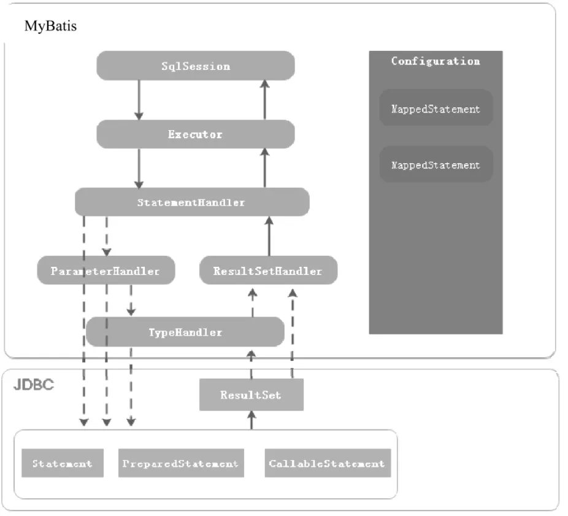

ref & 整理：https://mp.weixin.qq.com/s/ektluyCNiMd50q4b61bhXw

## Mybatis

### 1.原始 jdbc 连接方式
```java
public static final String DRIVER = "com.mysql.cj.jdbc.Driver";
public static final String URL = "jdbc:mysql://localhost:3306/doc_manage";
public static final String USER = "root";
public static final String PASS = "root";
// 注册 jdbc driver类。因为 class 加载的过程中，触发了其 static 静态方法，它会注册 driver 类到DriverManager
Class.forName(DRIVER);
Connection connection = DriverManager.getConnection(URL, USER, PASS);
Statement statement = connection.createStatement();
ResultSet resultSet = statement.executeQuery("select * from user limit 20");
while (resultSet.next()) {
    log.info("id: {}, username: {}, email: {}", resultSet.getInt("id"), resultSet.getString("Username"),
            resultSet.getString("Email"));
}
```

优点：
1.比较直观，原始的使用方式，只需要引入 mysql-connector 等 driver 类
缺点：
1.创建连接处用了硬编码
2.创建statement处用了硬编码
3.连接无法复用，频繁创建和断开连接，造成数据库资源浪费和消耗

### 2.数据层持久化框架
#### 2.1 ORM 系框架：hibernate
#### 2.2 utils 系框架：mybatis，JDBCTemplate

### 3.mybatis 基础用法
见 MybatisBasicUsageTest@testMybatisBasic()

#### 3.1 基础执行流程


### 4.mybatis 一级，二级缓存
#### 4.1 一级缓存
1.mybatis 一级缓存默认开启
2.一级缓存存在于 SqlSession 生命周期中，缓存没有过期时间，等 SqlSession 关闭之时，缓存会随着消失。
其原理是 缓存 查询条件相同下的结果数据，只要两次 statement 条件一样，且中间没有执行更新类操作（delete，update，insert），那么第二次就返回内存中缓存的结果。
其本质是一个内存中的map
我们可以在代码中调用 `session.clearCache()` 来主动清除缓存

3.可以通过在配置里主动关闭一级缓存
```xml
<settings>
    <setting name="cacheEnabled" value="false"/>
</settings>
```
或者在 Mapper 的具体查询方法上，加上注解 `@Options(flushCache = Options.FlushCachePolicy.TRUE)` 来主动声明

### 4.2 二级缓存
1.二级缓存需要手动开启。
2.二级缓存又叫全局缓存，比一级缓存作用域大。
3.二级缓存是基于 mapper 的 namespace 级别来区分的。具体是从查询语句的维度来缓存结果
也就是在同一个 mapper 维度下，相同的查询语句可以走缓存。
4.具体实现方式上，是在 SqlSession 执行query,提交或关闭后，将其生命周期中的一级缓存 转为二级缓存。

<b>根据这个事实，如果我们主动关了一级缓存，二级缓存也不会起作用。<b/>

5.开启方式
在所需要的 Mapper 的 xml 配置中，加入配置：
```xml
<cache eviction="FIFO" flushInterval="60000" size="512" readOnly="true" />
```
表明了淘汰策略 FIFO，存活时间60s，最多 512个引用，且返回对象是只读的，不可修改。

注意，返回的查询结果 对应的实体类需要实现 序列化的 Serializable 接口，否则会有问题

6.二级缓存配置使用 redis

6.1 pom.xml 中添加依赖：
```xml
<dependency>
    <groupId>org.mybatis.caches</groupId>
    <artifactId>mybatis-redis</artifactId>
    <version>1.0.0-beta2</version>
</dependency>
```

6.2 在 Mapper 对应 xml 配置中，cache 项使用 type 为 redisCache 类型
```xml 
<cache eviction="FIFO" flushInterval="60000" size="512" readOnly="true" type="org.mybatis.caches.redis.RedisCache" />
```

6.3 resource 目录下，新建一个配置 `redis.properties`，内容格式如下：
```properties
host=localhost
port=6379
connectionTimeout=3000
soTimeout=2000
password=
database=0
clientName=Mybatis_Cache
```

确保 redis 能顺利连接。到此配置完成

6.4 当执行查询时，顺序是优先找 一级缓存，未命中缓存则尝试找二级缓存。
实际一级缓存走内存 还是比二级缓存走 redis 要更快一些。

6.5 拓展：观察缓存中产生的 redis key 格式？
大体上是由几组变量拼接成的 key : `{namespace}:{statementId}:{param1}:{param2}:..."` ，具体前缀和详细格式可以找官方文档。

### todo
1.接入 redis cache源，如何自定义 key格式